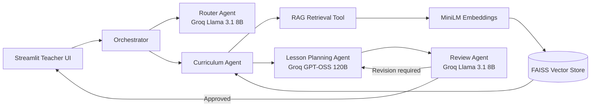
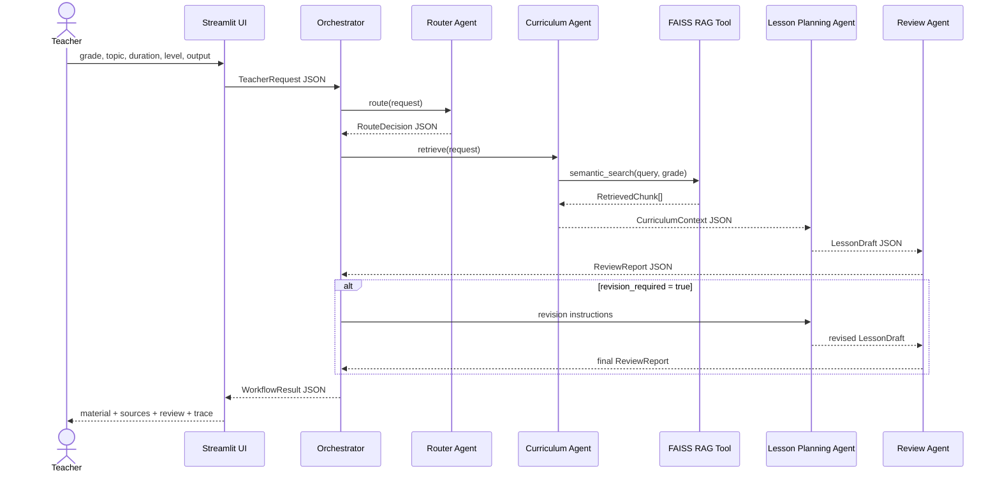

# EduAgent LK

**An Agentic AI Teaching Assistant for Sri Lankan Grade 9 and Grade 10 English Teachers**

> IT41043 — Intelligent Systems / Agentic AI assignment project

- **Live Streamlit demo:** `https://YOUR-APP-NAME.streamlit.app`
- **GitHub repository:** `https://github.com/YOUR-USERNAME/eduagent-lk`
- **Developer:** Replace with your name and student ID

## 1. Project Description

Sri Lankan English teachers often spend substantial time preparing lesson plans, worksheets, quizzes, answer keys and differentiated classroom activities. **EduAgent LK** accepts a grade, English topic, lesson duration, student-ability level and output type. A group of specialised agents then:

1. routes the request;
2. retrieves relevant Grade 9 or Grade 10 curriculum material;
3. creates classroom-ready teaching content;
4. reviews the output for grade suitability, language accuracy, clarity, curriculum alignment and answer-key quality;
5. sends the draft back for one revision when the quality threshold is not met.

This is a domain-specific teaching tool, not a generic PDF question-answering chatbot.

## 2. Main Features

- Grade 9 and Grade 10 selection
- Lesson Plan, Worksheet, Quiz and Revision Paper outputs
- Student levels: Needs Support, Average, Advanced and Mixed Ability
- RAG over a local English-teaching knowledge base
- Multiple agents exchanging validated Pydantic JSON messages
- Two deliberately selected Groq models for different subtasks
- Automatic reflection and revision loop
- Retrieved-source display and similarity scores
- Agent-message trace for the demonstration/viva
- Markdown and full-run JSON downloads
- Offline fallback mode for interface testing without API calls

## 3. Architecture



The editable Mermaid source is in `docs/architecture.mmd`.

## 4. Agentic Design Patterns

| Pattern | Implementation | Code location |
|---|---|---|
| Router | Classifies the requested output and complexity before work begins | `src/agents/router_agent.py` |
| Planning / task decomposition | Separates objectives, explanation, timed activities, assessment, exercise, answer key and homework | `src/agents/lesson_planner_agent.py` and `src/prompts.py` |
| Tool use / RAG | Curriculum Agent calls a semantic retrieval tool over Grade 9–10 knowledge documents | `src/agents/curriculum_agent.py` and `src/rag.py` |
| Reflection / self-critique | Review Agent scores five quality dimensions and returns revision instructions | `src/agents/review_agent.py` |
| Orchestrator–worker | Central orchestrator coordinates specialist agents and controls the revision loop | `src/orchestrator.py` |

The Curriculum Agent also performs a bounded retrieve-observe-retry cycle. It runs a second search when too few chunks are found or the mean similarity is weak. The system exposes only actions, observations and validated outputs; it does not expose hidden chain-of-thought.

## 5. Agents and Structured Communication

### Agents

1. **Router Agent** — selects the workflow route using the fast model.
2. **Curriculum Agent** — formulates a grade-specific query and uses the RAG tool.
3. **Lesson Planning Agent** — synthesises the full teaching material with the reasoning model.
4. **Review Agent** — checks quality and requests a revision when necessary.
5. **Orchestrator** — manages state and message flow.

Every message follows the `AgentMessage` schema in `src/schemas.py`:

```json
{
  "sender": "CurriculumAgent",
  "receiver": "LessonPlanningAgent",
  "performative": "inform",
  "task_id": "uuid",
  "payload": {
    "curriculum": "validated CurriculumContext object"
  },
  "timestamp": "ISO-8601 timestamp"
}
```

### Message-flow diagram



The editable source is in `docs/sequence.mmd`.

## 6. Model Selection Strategy

The default configuration uses two current Groq production models. Prices below are Groq list prices per one million tokens and should be rechecked before the final submission.

| Subtask | Model and provider | Input / output price | Context window | Approx. speed | Why chosen |
|---|---|---:|---:|---:|---|
| Intent routing, simple classification and review | `llama-3.1-8b-instant` on Groq | $0.05 / $0.08 | 131,072 tokens | ~560 tokens/s | Very low latency and cost; sufficient for constrained JSON routing and rubric-based checking |
| Lesson/worksheet generation and revision | `openai/gpt-oss-120b` on Groq | $0.15 / $0.60 | 131,072 tokens | ~500 tokens/s | Stronger reasoning and long-form synthesis justify a higher output cost for the main teaching artifact |
| Retrieval | `sentence-transformers/all-MiniLM-L6-v2` locally | No token API charge | Documents are chunked before embedding | Local | Small semantic embedding model suitable for a compact Streamlit RAG corpus |

The provider and model IDs are configurable through environment variables or Streamlit secrets. OpenRouter is also supported by `src/llm_clients.py`; change `REASONING_PROVIDER=openrouter` and provide an active OpenRouter model ID when required.

Official references:

- Groq supported models and pricing: https://console.groq.com/docs/models
- Groq API keys: https://console.groq.com/keys
- OpenRouter quickstart: https://openrouter.ai/docs/quickstart
- OpenRouter model catalogue: https://openrouter.ai/models

## 7. RAG Pipeline

### Corpus

The repository contains **24 original starter knowledge documents** under:

- `data/knowledge_base/grade9/`
- `data/knowledge_base/grade10/`

These make the project runnable immediately. For the final assessed corpus, use the official-source downloader:

```bash
python scripts/download_official_sources.py --pages-per-doc 8
```

It downloads the official NIE Grade 9 and Grade 10 English Teachers' Guides and converts each guide into page-range Markdown documents. The source URL is written into every generated document. Depending on guide length, this produces more than 20 domain documents or equivalent. Use a smaller value such as `--pages-per-doc 5` when more separate documents are required.

Do not commit downloaded PDFs unless their licence and your lecturer's instructions permit it. The script downloads them from the official source for local processing and removes the PDF files by default after extraction.

Additional official resources are listed in `data/source_catalog.csv`:

- NIE Grade 9 English Teachers' Guide
- NIE Grade 10 English Teachers' Guide
- e-Thaksalawa Grade 9 English course resources
- e-Thaksalawa Grade 10 English resources
- Grade-specific past papers and marking schemes

### Loading

`KnowledgeBase.load_documents()` recursively loads `.md`, `.txt` and `.pdf` files. PDF text is extracted with `pypdf`.

### Chunking strategy

- **Chunk size:** 320 words
- **Overlap:** 55 words
- **Reason:** lesson outcomes, examples and assessment guidance often cross paragraph boundaries; moderate overlap retains local context without producing many near-duplicate chunks.
- **Metadata:** source path, inferred grade, topic and chunk ID.

### Embeddings

Default model: `sentence-transformers/all-MiniLM-L6-v2`.

Embeddings are normalised so inner-product similarity behaves as cosine similarity. When the model cannot load, a deterministic hashing embedder provides a graceful demonstration fallback. The final deployed version should successfully load the sentence-transformer model.

### Vector store

FAISS `IndexFlatIP` stores normalised vectors and returns high-similarity chunks. A NumPy similarity fallback is present for environments where FAISS cannot load.

### Retrieval process

1. Curriculum Agent creates a query containing grade, topic, learning outcomes, activities, assessment and learner level.
2. The vector store searches a larger candidate set.
3. Results are filtered by grade.
4. Top `k=5` chunks are returned.
5. If retrieval is weak, the Curriculum Agent performs one simpler retry query.
6. Sources and similarity scores are included in the UI and planner prompt.

## 8. Retrieval Evaluation

Five sample queries are stored in `data/evaluation_queries.json`.

Run:

```bash
python scripts/evaluate_retrieval.py
```

The script saves `data/retrieval_evaluation_results.json`. For each query, inspect the top five sources and write a short manual comment in your final README or report.

Suggested evaluation table after running the script:

| Query | Top retrieved topics | Relevant? | Comment |
|---|---|---|---|
| Grade 9 reported speech lesson | Complete after running | Yes / No | Explain whether the chunks cover transformations, examples and learning outcomes |
| Grade 9 WH-question activity | Complete after running | Yes / No | Explain question formation and classroom activity relevance |
| Grade 10 passive voice assessment | Complete after running | Yes / No | Explain whether form and assessment evidence are present |
| Grade 10 formal letter writing | Complete after running | Yes / No | Explain structure and formal-language relevance |
| Mixed-ability grammar differentiation | Complete after running | Yes / No | Explain whether support and extension strategies were retrieved |

Do not invent the final evaluation results. Run the script after adding official documents and report the actual retrieved sources.

## 9. Project Structure

```text
eduagent-lk/
├── app.py
├── README.md
├── requirements.txt
├── .env.example
├── .gitignore
├── pytest.ini
├── LICENSE
├── .streamlit/
│   ├── config.toml
│   └── secrets.toml.example
├── .github/
│   └── workflows/
│       └── tests.yml
├── data/
│   ├── evaluation_queries.json
│   ├── source_catalog.csv
│   ├── official_sources/
│   ├── vector_store/
│   └── knowledge_base/
│       ├── grade9/                 # 12 starter documents + generated official docs
│       └── grade10/                # 12 starter documents + generated official docs
├── docs/
│   ├── architecture.mmd
│   └── sequence.mmd
├── scripts/
│   ├── download_official_sources.py
│   ├── ingest.py
│   └── evaluate_retrieval.py
├── src/
│   ├── config.py
│   ├── llm_clients.py
│   ├── orchestrator.py
│   ├── prompts.py
│   ├── rag.py
│   ├── schemas.py
│   ├── utils.py
│   └── agents/
│       ├── base.py
│       ├── router_agent.py
│       ├── curriculum_agent.py
│       ├── lesson_planner_agent.py
│       └── review_agent.py
└── tests/
    ├── test_schemas.py
    ├── test_rag.py
    └── test_orchestrator.py
```

## 10. Local Setup

### Prerequisites

- Python 3.11 recommended
- Git
- A Groq API key

### Commands

```bash
git clone https://github.com/YOUR-USERNAME/eduagent-lk.git
cd eduagent-lk

python -m venv .venv
```

Windows PowerShell:

```powershell
.\.venv\Scripts\Activate.ps1
```

macOS/Linux:

```bash
source .venv/bin/activate
```

Install dependencies:

```bash
python -m pip install --upgrade pip
pip install -r requirements.txt
```

Create local secrets:

```bash
mkdir .streamlit
```

Copy `.streamlit/secrets.toml.example` to `.streamlit/secrets.toml` and add your key:

```toml
GROQ_API_KEY = "your-real-key"
FAST_PROVIDER = "groq"
FAST_MODEL = "llama-3.1-8b-instant"
REASONING_PROVIDER = "groq"
REASONING_MODEL = "openai/gpt-oss-120b"
REVIEW_PROVIDER = "groq"
REVIEW_MODEL = "llama-3.1-8b-instant"
OFFLINE_DEMO = "false"
```

Add official documents and run checks:

```bash
python scripts/download_official_sources.py --pages-per-doc 8
python scripts/ingest.py
python scripts/evaluate_retrieval.py
pytest -q
```

Run the app:

```bash
streamlit run app.py
```

## 11. Streamlit Community Cloud Deployment

1. Push the final merged `main` branch to GitHub.
2. Open Streamlit Community Cloud.
3. Select the repository, `main` branch and `app.py` entry point.
4. Open **Advanced settings → Secrets**.
5. Paste the contents of `.streamlit/secrets.toml`, including the real `GROQ_API_KEY`.
6. Select a supported Python version, preferably Python 3.11 if available.
7. Deploy and test several Grade 9 and Grade 10 requests.
8. Replace the placeholder live URL at the top of this README.

Never commit `.streamlit/secrets.toml` or `.env`. Both are ignored by `.gitignore`.

Official deployment documentation:

- https://docs.streamlit.io/deploy/streamlit-community-cloud/deploy-your-app/deploy
- https://docs.streamlit.io/deploy/streamlit-community-cloud/deploy-your-app/secrets-management

## 12. Git and GitHub Workflow

Create the repository and development branch:

```bash
git init
git add README.md .gitignore
git commit -m "docs: initialise EduAgent LK repository"
git branch -M main
git remote add origin https://github.com/YOUR-USERNAME/eduagent-lk.git
git push -u origin main

git checkout -b develop
git push -u origin develop
```

Use one branch per feature and merge it through a Pull Request:

```bash
git checkout develop
git pull
git checkout -b feature/rag-pipeline
# make and test a small set of changes
git add src/rag.py data/knowledge_base scripts/ingest.py
git commit -m "feat: implement grade-filtered FAISS retrieval"
git push -u origin feature/rag-pipeline
```

Recommended feature branches:

- `feature/project-foundation`
- `feature/structured-messages`
- `feature/model-router`
- `feature/rag-pipeline`
- `feature/curriculum-agent`
- `feature/lesson-planner`
- `feature/review-reflection`
- `feature/streamlit-ui`
- `feature/retrieval-evaluation`
- `docs/readme-diagrams`
- `test/core-workflow`
- `fix/deployment-errors`

### Suggested meaningful commit sequence

Make each commit only after you have actually completed and tested that increment. Do not upload all files in one artificial bulk commit and do not falsify dates.

1. `docs: initialise repository and project scope`
2. `chore: add environment and secrets templates`
3. `feat: define validated agent message schemas`
4. `feat: add Groq and OpenRouter chat client`
5. `feat: implement request routing agent`
6. `feat: add document loading and chunking`
7. `feat: implement embedding and FAISS retrieval`
8. `feat: add grade-specific curriculum agent`
9. `feat: implement lesson planning agent`
10. `feat: add structured quality review agent`
11. `feat: implement reflection and revision loop`
12. `feat: build Streamlit teacher input interface`
13. `feat: display sources quality scores and agent trace`
14. `test: add schema retrieval and workflow tests`
15. `feat: add five-query retrieval evaluation`
16. `ci: run tests with GitHub Actions`
17. `docs: add architecture model comparison and setup`
18. `fix: handle missing keys and model API errors`
19. `fix: resolve Streamlit Cloud deployment issues`
20. `docs: add live demo and final limitations`

## 13. Tests

```bash
pytest -q
```

The tests cover:

- input schema validation;
- grade-filtered retrieval;
- end-to-end offline agent workflow;
- generated answer-key presence;
- structured message creation.

GitHub Actions runs the tests on pushes and pull requests.

## 14. Example Demonstration

Input:

```text
Grade: 9
Topic: Reported Speech
Duration: 45 minutes
Student level: Average
Output type: Lesson Plan
Extra: Include pair work and an exit ticket.
```

Expected app process:

1. Router Agent selects `lesson_plan`.
2. Curriculum Agent retrieves Grade 9 reported-speech and assessment chunks.
3. Lesson Planning Agent creates timed classroom material.
4. Review Agent returns five rubric scores.
5. When a score is below four, the orchestrator requests one revision.
6. UI displays the final lesson, answer key, sources and message trace.

## 15. Error Handling and Secrets

- Missing API keys activate a clearly labelled fallback rather than exposing a stack trace.
- API request errors are converted into `LLMUnavailableError`.
- Invalid teacher inputs are blocked by Pydantic validation and Streamlit controls.
- Empty or unreadable documents are skipped.
- FAISS failure falls back to NumPy similarity.
- API keys are loaded from Streamlit secrets or environment variables only.
- `.gitignore` excludes `.env`, `secrets.toml`, generated vector files and downloaded PDFs.

Before publishing, check Git history for accidentally committed keys. If a key was ever committed, revoke it immediately and create a new key; deleting the visible file is not sufficient.

## 16. Known Limitations

- Official curriculum PDFs may have imperfect extracted text or scanned pages.
- Similarity score alone does not prove syllabus correctness; a teacher should verify generated content.
- The prototype supports only Grades 9 and 10 English.
- The current reflection loop is bounded to one revision to control latency and cost.
- Model availability and pricing can change, so model IDs must be verified before marking.
- The fallback hashing embedder is for graceful demonstration only and is weaker than the configured sentence-transformer.
- The app generates Markdown, not a fully formatted DOCX or PDF worksheet.
- The tool does not replace professional teacher judgement.

## 17. Future Improvements

- Sinhala explanation toggle for teachers
- DOCX/PDF worksheet export
- teacher feedback storage and rubric analytics
- topic-specific retrieval re-ranker
- automated answer-key consistency tests
- authentication and saved lesson history
- support for Grades 6–11

## 18. Licence and Source Responsibility

Project source code is provided under the MIT Licence. Official curriculum resources remain the property of their respective publishers. Store source URLs and use documents according to their licence and institutional requirements.
